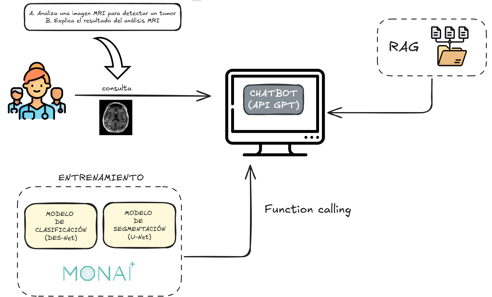

<p align="center">
  
  
</p>

# SWARM de Agentes para Asistencia Médica con Inteligencia Artificial

[](https://www.python.org/)
[](https://reactjs.org/)
[](https://fastapi.tiangolo.com/)
[](https://www.docker.com/)

## Descripción

Este proyecto desarrolla un asistente virtual avanzado para profesionales médicos, diseñado para optimizar el flujo de trabajo clínico y apoyar en el diagnóstico y la gestión de información. La plataforma integra un chatbot, permitiendo una interacción fluida y natural.

## DEMO
<video src="backend/data/logos/demo.mp4" width="320" height="240" controls></video>


### Funcionalidades Clave

- **Agente Clasificador:** Red neuronal encargada de estimar la probabilidad de tumor para un MRI.
- **Agente Segmentador:** Red neuronal encargada de realizar la segmentación del tumor detectado en la imagen.
- **Agente RAG (Retrieval Augmented Generation):** Acceso rápido y contextualizado a una base de datos de pacientes para obtener información especializada sobre su caso.
- **Agente Triaje:** Evaluación y triaje para establecer urgencia del caso clínico en virtud de la información recuperada y el análisis de las imágenes MRI.
- **Agente Orquestador:** Coordinación de todo el proceso en base a los requerimientos del médico.
- **Agente Planificador:** Planificación de todo el flujo de trabajo y organización de agentes en base a las órdenes del orquestador.
- **Agente Reportador:** Generación de documentación de todo el proceso y un informe final en formato PDF.
- **Agente Validador:** Comprobación y verificación del reporte generado.

## Estructura del Proyecto

```
.
├── backend/
│   ├── Dockerfile
│   ├── main.py
│   ├── requirements.txt
│   └── src/
│       ├── agents/
│       ├── config/
│       └── tools/
├── frontend/
│   ├── Dockerfile
│   ├── package.json
│   └── src/
│       ├── components/
│       ├── assets/
│       └── context/
├── docker-compose.yml
├── README.md
└── swarm_strands.ipynb
```

## Componentes Tecnológicos

- **Backend:** Python, FastAPI, Strands Agents, ChromaDB.
- **Frontend:** React, Vite.
- **Contenerización:** Docker, Docker Compose.
- **Modelos de IA:** OpenAI y finetuning sobre DenseNet-121 y U-Net.

## Instalación y Uso

### Prerrequisitos

- Docker instalado.
- Git para clonar el repositorio.

### Pasos

1.  **Clonar el repositorio:**
    ```bash
    git clone https://github.com/tu_usuario/tu_repositorio.git
    cd tu_repositorio
    ```

2.  **Configurar variables de entorno:**
    - Crear un archivo `.env` backend/ y añadir las claves de API necesarias (ej. `OPENAI_API_KEY`).

3.  **Levantar los servicios con Docker Compose:**
    ```bash
    docker-compose up -d --build
    ```

4.  **Acceder a la aplicación:**
    - **Frontend:** `http://localhost:3000`
    - **Backend (API Docs):** `http://localhost:8000`
