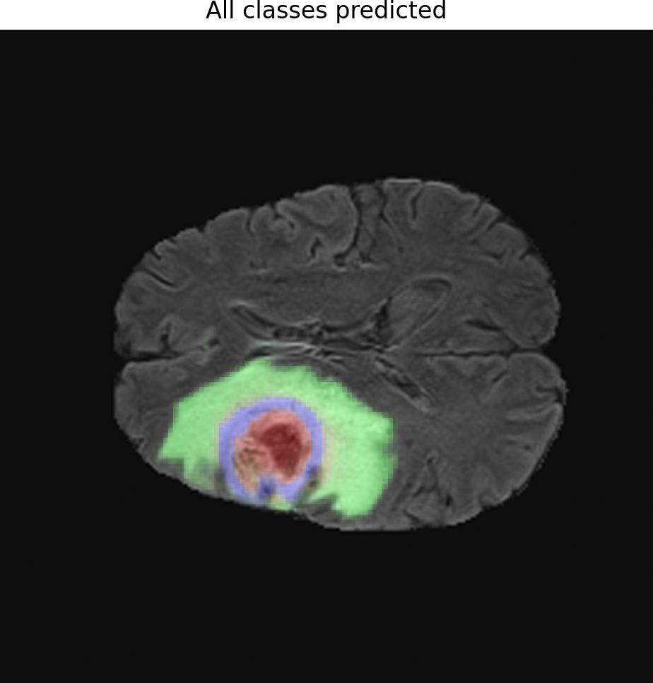

<p align="center">
  
  
</p>

# Asistente Médico Virtual con IA

[](https://www.python.org/)
[](https://reactjs.org/)
[](https://fastapi.tiangolo.com/)
[](https://www.docker.com/)

## Descripción

Este proyecto desarrolla un asistente virtual avanzado para profesionales médicos, diseñado para optimizar el flujo de trabajo clínico y apoyar en el diagnóstico y la gestión de información. La plataforma integra un chatbot y un voicebot, permitiendo una interacción fluida y natural.

### Funcionalidades Clave

- **Análisis de Imágenes Médicas:** Segmentación y clasificación de imágenes de resonancia magnética (MRI) cerebrales para la detección de tumores.
- **Sistema RAG (Retrieval Augmented Generation):** Acceso rápido y contextualizado a una base de conocimientos médicos para resolver dudas y obtener información relevante.
- **Agentes Especializados:**
  - **Redactor de Informes:** Generación automática de borradores de informes médicos.
  - **Validador de Información:** Verificación de la consistencia y fiabilidad de los datos.

## Estructura del Proyecto

```
.
├── backend/
│   ├── Dockerfile
│   ├── main.py
│   ├── requirements.txt
│   └── src/
│       ├── agents/
│       ├── config/
│       └── tools/
├── frontend/
│   ├── Dockerfile
│   ├── package.json
│   └── src/
│       ├── components/
│       ├── assets/
│       └── context/
├── docker-compose.yml
├── README.md
└── swarm_strands.ipynb
```

## Componentes Tecnológicos

- **Backend:** Python, FastAPI, Strands Agents, ChromaDB.
- **Frontend:** React, Vite.
- **Contenerización:** Docker, Docker Compose.
- **Modelos de IA:** Modelos personalizados para clasificación y segmentación de tumores, y modelos de lenguaje para el sistema RAG y los agentes.

## Instalación y Uso

### Prerrequisitos

- Docker y Docker Compose instalados.
- Git para clonar el repositorio.

### Pasos

1.  **Clonar el repositorio:**
    ```bash
    git clone https://github.com/tu_usuario/tu_repositorio.git
    cd tu_repositorio
    ```

2.  **Configurar variables de entorno:**
    - Crear un archivo `.env` backend/ y añadir las claves de API necesarias (ej. `OPENAI_API_KEY`).

3.  **Levantar los servicios con Docker Compose:**
    ```bash
    docker-compose up -d --build
    ```

4.  **Acceder a la aplicación:**
    - **Frontend:** `http://localhost:3000`
    - **Backend (API Docs):** `http://localhost:8000`